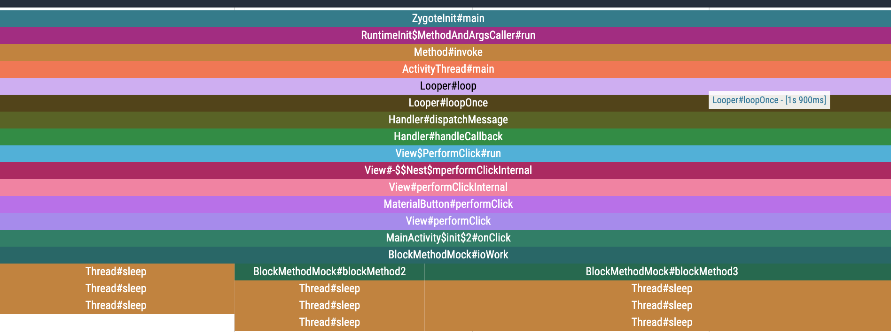

# 实现原理


## 1.概述

通过stack采样，统计分析方法的开始，结束，从而统计出方法耗时。  
初始化：blockcanary.BlockCanary#install

## 2.方法耗时检测（双检测）
1. 通过android.os.Looper#setMessageLogging，监听方法执行时间。  

代码：  
blockcanary.LooperMonitor#resetPrinter  
```java

    private synchronized void resetPrinter() {
        ...
        looper.setMessageLogging(printer = new LooperPrinter(originPrinter));
        ...
    }
```

2. 通过blockcanary.BlockCanaryInternal.SlowMessageWatchdog监听方法耗时（在looper长时间阻塞的时候回触发，防止此case统计丢失）


代码：  
blockcanary.BlockCanaryInternal#messageListener
 
```java
private val messageListener = object : LooperMonitor.MessageDispatchListener() {

        override fun onDispatchStart(x: String?) {
            ...
            handler.postDelayed(SlowMessageWatchdog(messageInfo), blockCanaryConfig.blockMaxThresholdTime.toLong())
        }

        override fun onDispatchEnd(x: String?) {
            ...
            handler.removeCallbacksAndMessages(null)
            ...
        }

    }

```


## 3.stack采样

实现类：com.knightboost.stacksampler.StackSampler

启动一个定时器，每隔一段时间采集主线程栈，并记录在链表中，循环记录20s内的栈采样数据。  
代码：
```java

    public synchronized void startSampling() {
        ...
        scheduler.scheduleAtFixedRate(new Runnable() {
            @Override
            public void run() {

                long wallTime = FastTimer.currentTimeMillis();
                //todo support cpu time by read /proc/pid/tid/..
                StackTraceElement[] stackTraceElements = targetThread.getStackTrace();
                StackTraceSample stackTraceSample = new StackTraceSample(wallTime, stackTraceElements);
                synchronized (queueLock){
                    if (stackTraceSampleQueue.size()>maxCacheCount){
                        stackTraceSampleQueue.poll();
                    }
                    stackTraceSampleQueue.offer(stackTraceSample);
                }

            }
        }, 0, sampleInterval, TimeUnit.MILLISECONDS);
        ...
    }

```

当检测到耗时方法时，获取耗时时间区间的采样数据，保存成json文件。  
代码:blockcanary.BlockCanaryInternal#onBlockDetect  
 
```java
private fun onBlockDetect(blockInfo: BlockInfo) {
        ...
        CanaryExecutors.workExecutor
            .execute {
                val dispatchStartTime = blockInfo.startTime
                val stackSamples = stackSampler.getStackSamplesBetweenWallTime(dispatchStartTime, blockInfo.endTime)
                blockInfo.stackTraceSamples.addAll(stackSamples)
                blockInfoRepository.insertBlockInfo(blockInfo)
                ...
            }
    }

```

代码：com.knightboost.stacksampler.StackSampler#getStackSamplesBetweenWallTime 
```java

    public List<StackTraceSample> getStackSamplesBetweenWallTime(long beginTime, long endTime){
        ArrayList<StackTraceSample> stackTraceSamples = null;
        synchronized (queueLock){
             stackTraceSamples = new ArrayList<>(stackTraceSampleQueue);
        }

        ArrayList<StackTraceSample> result = new ArrayList<>();

        for (int i = 0; i < stackTraceSamples.size(); i++) {
            StackTraceSample item = stackTraceSamples.get(i);
            long time = item.getTime();
            if (time>=beginTime && time<=endTime){
                result.add(item);
            }
        }
        return result;
    }

```


## 4.将栈采样json文件转成perfetto格式
栈采样json文件保存路径：/data/data/com.knightboot.blocakCananry.sapmle/cache/blockCanary/

执行python脚本：
python3 ./python/block2perfetto.py "要转换的采样json文件"

效果图：  
<br>
